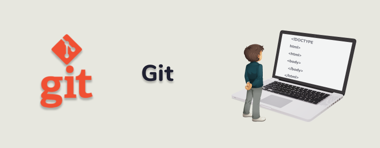

[< К содержанию](./readme.md)

# **Что такое Git и для чего он нужен?**

**Git** — система управления версиями с распределенной архитектурой

Разработка в Git ориентирована на обеспечение высокой производительности, безопасности и гибкости распределенной системы.

